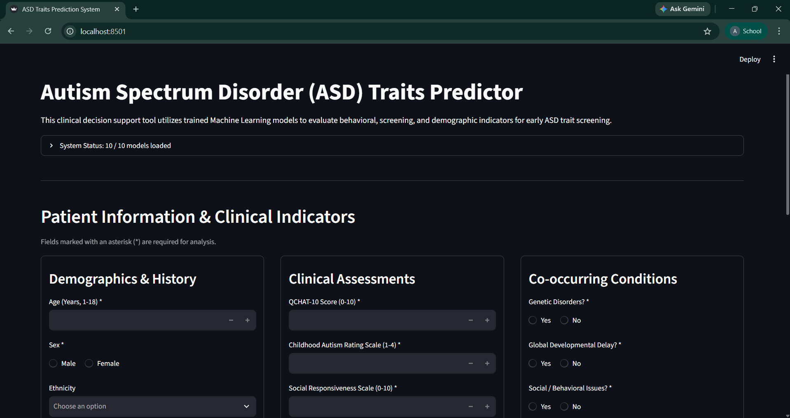
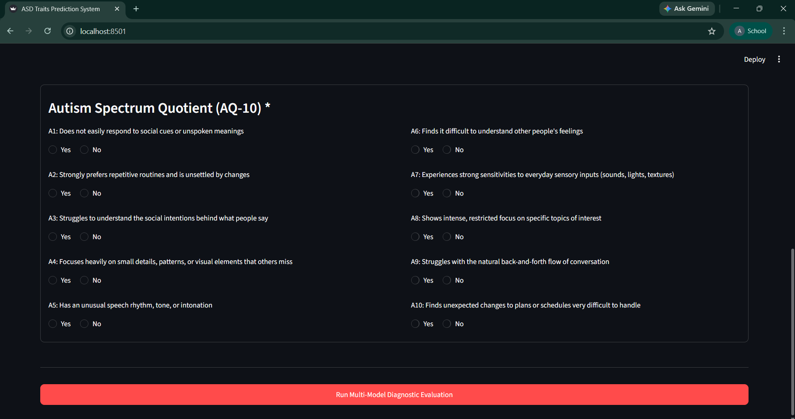
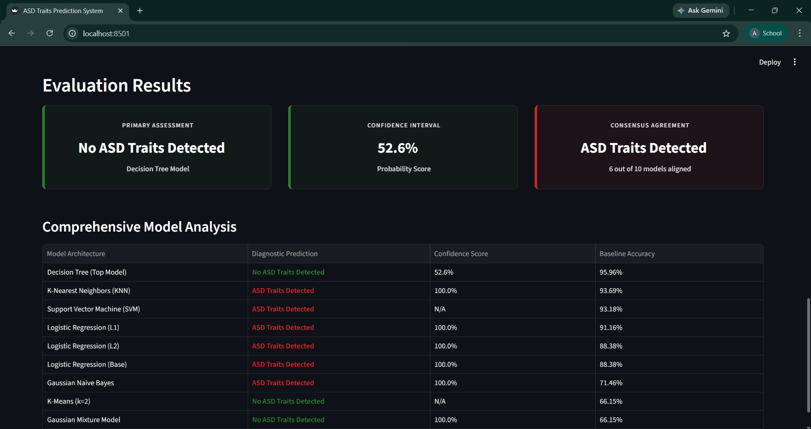

# Autism Spectrum Disorder Classification and Clustering System

A comprehensive machine learning project analyzing and classifying Autism Spectrum Disorder (ASD) traits in children and adolescents (ages 1–18) using both **supervised** and **unsupervised** learning techniques in Python.

---

## Dataset Overview

The dataset used in this project is the [ASD Children Traits Dataset](https://www.kaggle.com/datasets/uppulurimadhuri/dataset) sourced from Kaggle, originally compiled by researchers at the **University of Arkansas (Computer Science Department)**. It contains demographic details, clinical screening scores, and behavioral indicators used to predict whether a child exhibits Autism Spectrum Disorder (ASD) traits.

### Dataset Specifications

* **Size:** 1,985 rows × 28 columns
* **Target Variable:** Binary classification (`0` = No ASD Traits, `1` = ASD Traits)
* **Target Demographic:** Children and adolescents aged 1 to 18 years old.

### Key Attributes Included

* **Screening Scores:** Autism Spectrum Quotient (AQ-10 / Columns A1–A10), QCHAT-10, Childhood Autism Rating Scale (CARS), Social Responsiveness Scale (SRS)
* **Clinical & Developmental Factors:** Speech delay/language disorder, learning disorders, genetic disorders, global developmental delay, anxiety, and depression
* **Demographic & Medical History:** Age (years), Sex, and family history of ASD.
> **Note:** Ethnicity and Neonatal Jaundice are included in the raw dataset but were excluded during feature selection; they are not required inputs for the models as the system was not trained on them.
---

## Data Preprocessing Pipeline

1. **Missing Values:** Imputed missing entries using feature-wise mean imputation.
2. **Categorical Encoding:** Converted non-numeric categorical attributes using one-hot/dummy encoding (`pd.get_dummies`).
3. **Feature Selection:** Dropped non-essential demographic features (e.g., Ethnicity, Jaundice) to optimize model performance.
4. **Feature Scaling:** Standardized numerical features using `StandardScaler` to bring all attributes to a uniform scale.
5. **Dimensionality Reduction:** Applied **Principal Component Analysis (PCA)** for dimensionality reduction and 2D cluster visualization.

---

## Models Implemented

### 1. Supervised Learning (`supervised_models.ipynb`)

Evaluated multiple classification algorithms using an 80/20 train-test split:

* Logistic Regression (Base, L1, and L2 Regularization)
* K-Nearest Neighbors (KNN)
* Gaussian Naive Bayes
* Decision Tree Classifier
* Support Vector Machine (SVM with RBF kernel)

### 2. Unsupervised Learning (`unsupervised_models.ipynb`)

Explored natural data groupings and cluster behavior across full datasets and subsets:

* **K-Means Clustering** (with Elbow and Silhouette methods for optimal $k$)
* **Hierarchical/Agglomerative Clustering** (with dendrogram visualization)
* **Gaussian Mixture Models (GMM)**
* **Fuzzy C-Means Clustering** (using `scikit-fuzzy`)

---

## Project Structure

Based on the repository architecture:

```text
ASD-Classification/
│
├── data/
│   ├── data.csv                 # Raw dataset
│   └── final_cleaned.csv        # Preprocessed and cleaned dataset
│
├── supervised_models/           # Pickled trained supervised models and scaler
│   ├── decision_tree.pkl
│   ├── knn.pkl
│   ├── l1_logistic.pkl
│   ├── l2_logistic.pkl
│   ├── logistic.pkl
│   ├── naive_bayes.pkl
│   ├── scaler.pkl
│   └── svm.pkl
│
├── unsupervised_models/         # Pickled trained unsupervised models and PCA
│   ├── divisive_kmeans.pkl
│   ├── gmm.pkl
│   ├── kmeans.pkl
│   └── pca.pkl
│
├── app.py                       # Streamlit interactive web interface
├── data_preprocessing.ipynb     # Exploratory data analysis and cleaning pipeline
├── README.md                    # Project documentation
├── requirements.txt             # Project dependencies
├── supervised_models.ipynb      # Supervised classification models and evaluation
└── unsupervised_models.ipynb    # Clustering, dimensionality reduction, and evaluation
```

---

## Performance Leaderboards

### Supervised Learning:

| Model Name | Accuracy | F1-Score |
| --- | --- | --- |
| Logistic Regression | 88.38% | 0.8905 |
| L1 Logistic Regression | 91.16% | 0.9176 |
| L2 Logistic Regression | 88.38% | 0.8905 |
| K-Nearest Neighbors (KNN) | 93.69% | 0.9406 |
| Gaussian Naive Bayes | 71.46% | 0.7139 |
| **Decision Tree** | **95.96%** | **0.9623** |
| Support Vector Machine (SVM) | 93.18% | 0.9343 |

* **Winner:** **Decision Tree** predicted the most correctly with an Accuracy of **95.96%** and an F1-Score of **0.9623**.

### Unsupervised Learning:

| Model Name | Accuracy | F1-Score |
| --- | --- | --- |
| **K-Means ($k=2$)** | **66.15%** | **0.6842** |
| Agglomerative ($k=2$) | 66.15% | 0.6842 |
| Divisive Approx ($k=2$) | 66.15% | 0.6842 |
| Gaussian Mixture ($k=2$) | 66.15% | 0.6842 |
| Fuzzy C-Means (Test Set) | 65.24% | 0.6584 |

* **Winner:** **K-Means ($k=2$)** predicted the most correctly with an Accuracy of **66.15%** and an F1-Score of **0.6842**.

---

## Screenshots

### 1. Patient Information & Clinical Indicators

*Interactive interface for inputting clinical history and demographic details for patients aged 1–18.*

### 2. Autism Spectrum Quotient (AQ-10) Assessment

*Behavioral screening questionnaire required for the model's feature inputs.*


### 3. Prediction Results & Model Evaluation

*Final classification output showcasing the top-performing Decision Tree prediction alongside clustering insights.*

---

## How to Run Locally

1. Clone or download this repository.
2. Open your terminal in the project root directory and install the required dependencies:
```bash
 pip install -r requirements.txt
```

1. Clone or download this repository.
2. Open the project folder in your terminal and install the required dependencies:
```bash
pip install -r requirements.txt
```

3. To view the model training and evaluation process, open **Jupyter Notebook** and run the files sequentially:
* `data_preprocessing.ipynb`
* `supervised_models.ipynb`
* `unsupervised_models.ipynb`

4. To launch the interactive ASD Prediction GUI, run the following Streamlit command:
```bash
streamlit run app.py
```

---

## Academic Context

This project was developed for the course **AI372 - Machine Learning** at **UMT**.
* **Objective:** To apply both supervised and unsupervised machine learning models taught in class to a real-world disease/disorder detection dataset, comparing model performances and evaluating clustering vs. classification efficacy.
* **Term:** Fall 2025 — 5th Semester
